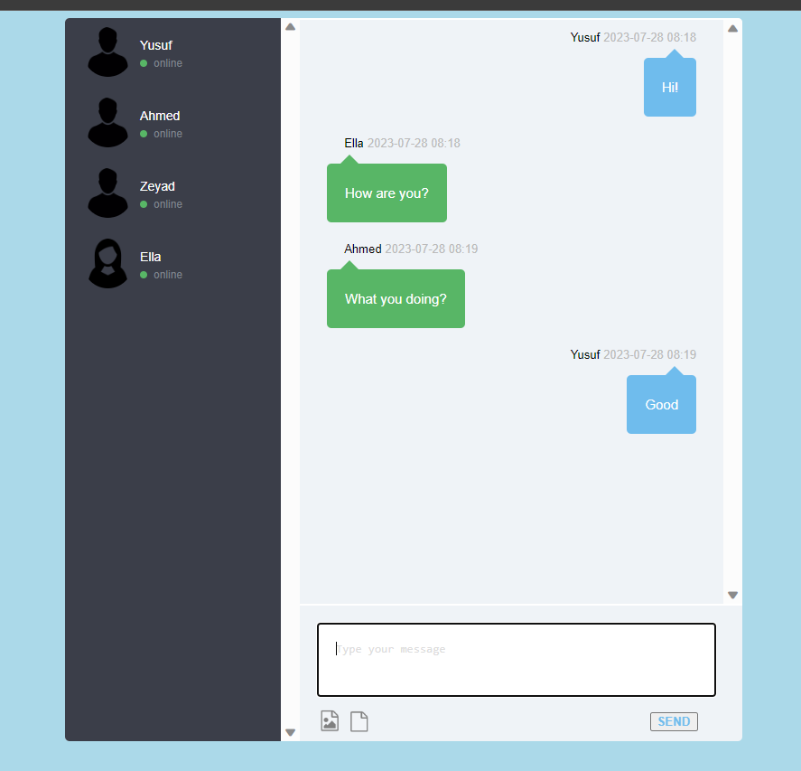
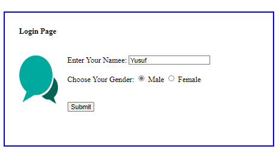

# WebSocket Chat APP

## Tasks


The Chat App is a dynamic and real-time communication platform developed using JSP (JavaServer Pages), AJAX (Asynchronous JavaScript and XML), Servlet, and JakartaEE, with the added functionality of WebSockets. The app allows multiple users to join chat groups and engage in seamless, interactive conversations.

## Views


## To Run App

``` bash
mvn install tomcat7:deploy
```

## Used Technologies

- Java: v19
- Jakarta EE: v9.0.0
- Apache Maven: v3.8.7
- Tomcat: 10.1
- HTML/CSS/JS
- AJAX
- Websocket
